# Exploratory Data Analysis

All 20 questions from the project brief, answered with a chart and the numbers behind it. Generated by [`02_eda.py`](02_eda.py) from [`cleaned_housing.csv`](cleaned_housing.csv.gz).

## 1–5: Price & Size Analysis

**Q1. What is the distribution of property prices?**
mean = 254.6 Lakhs, median = 253.9, range 10–500.
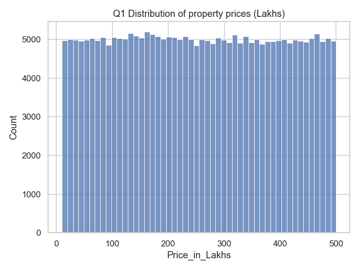

**Q2. What is the distribution of property sizes?**
mean = 2,750 sq ft, range 500–5,000.
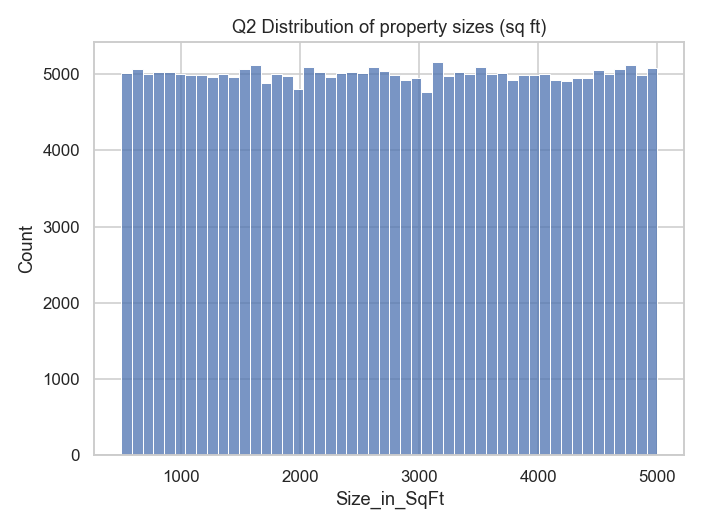

**Q3. How does price per sq ft vary by property type?**
Apartment ₹13,047, Independent House ₹13,102, Villa ₹13,026 — essentially flat.
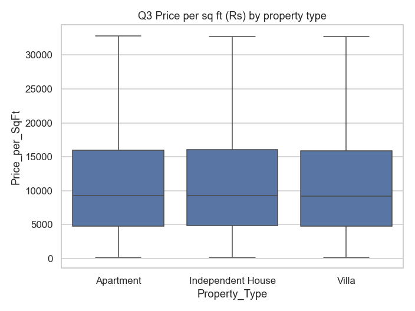

**Q4. Is there a relationship between property size and price?**
Correlation = **-0.003** — none. This is the first sign the dataset is synthetically generated rather than sampled from a real market.
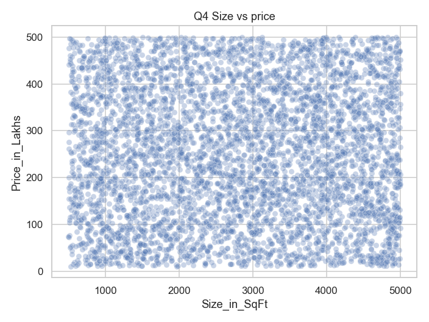

**Q5. Are there any outliers in price per sq ft or property size?**
Price/sqft: 19,723 outliers (7.9%) by the IQR rule. Size: none.
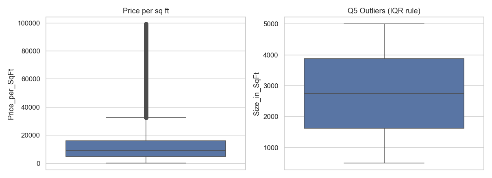

## 6–10: Location-based Analysis

**Q6. What is the average price per sq ft by state?**
Highest: Karnataka (₹13,252). Lowest: Punjab (₹12,931) — a ~2.5% spread across all 20 states.
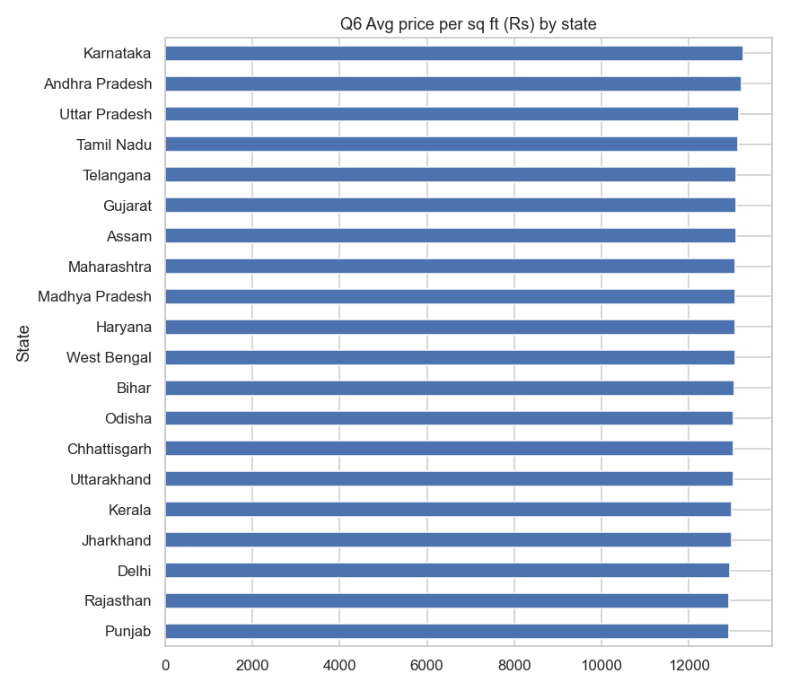

**Q7. What is the average property price by city?**
Highest: Bangalore (₹258.5L). Lowest: Cuttack (₹250.8L) — again a very narrow spread across 42 cities.
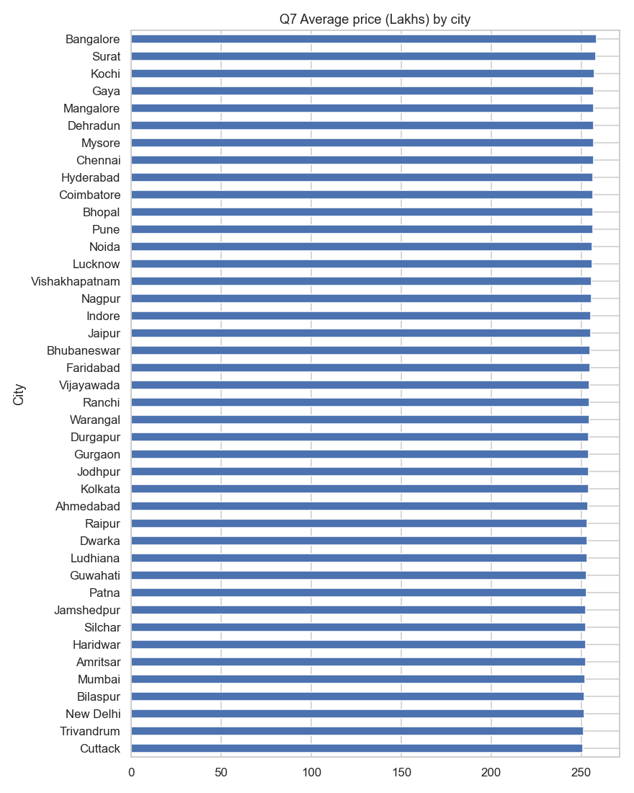

**Q8. What is the median age of properties by locality?**
Locality medians cluster tightly: 16–21 years, overall median 18 years, across 500 localities.
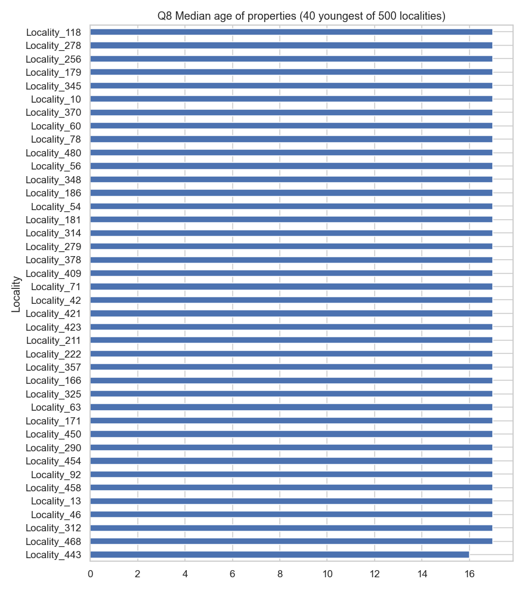

**Q9. How is BHK distributed across cities?**
Almost perfectly uniform — about 20% each of 1–5 BHK in every city.
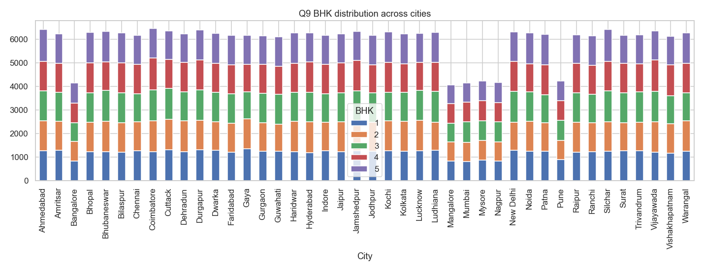

**Q10. What are the price trends for the top 5 most expensive localities?**
Top 5: Locality_207, Locality_416, Locality_246, Locality_359, Locality_387. The dataset has no sale dates, so `Year_Built` is used as the time axis (a proxy).
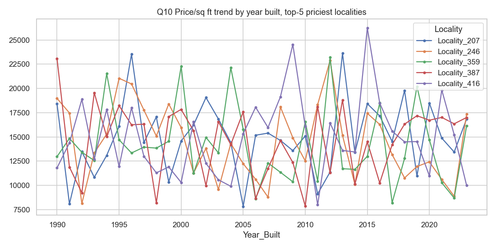

## 11–15: Feature Relationship & Correlation

**Q11. How are numeric features correlated with each other?**
Only `Price_per_SqFt` correlates meaningfully with `Price_in_Lakhs` (0.556 — expected, since one is derived from the other). Everything else — hospitals, age, size — is ~0.003.
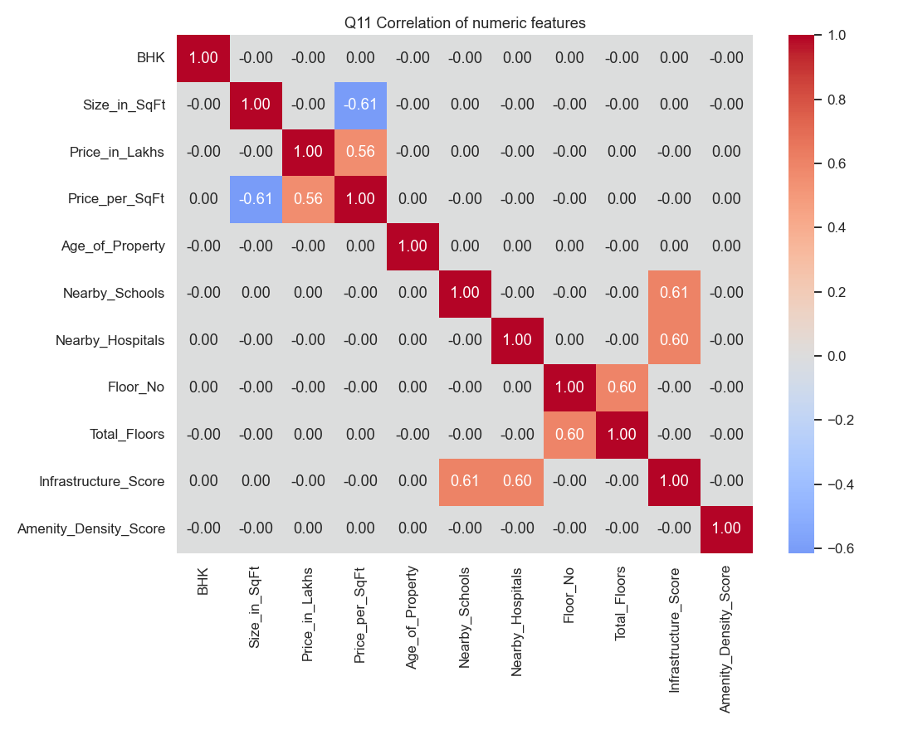

**Q12. How do nearby schools relate to price per sq ft?**
Correlation ≈ 0.000 — no relationship.
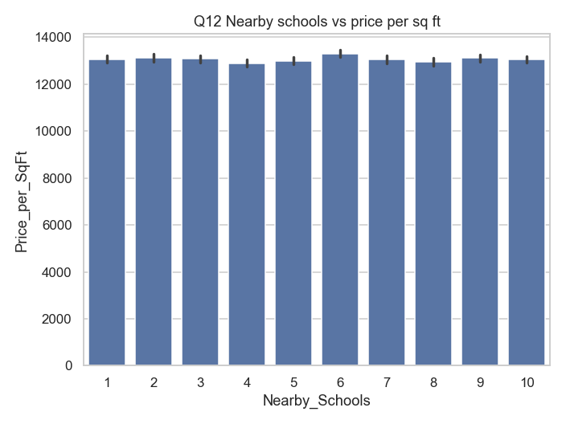

**Q13. How do nearby hospitals relate to price per sq ft?**
Correlation ≈ 0.000 — no relationship.
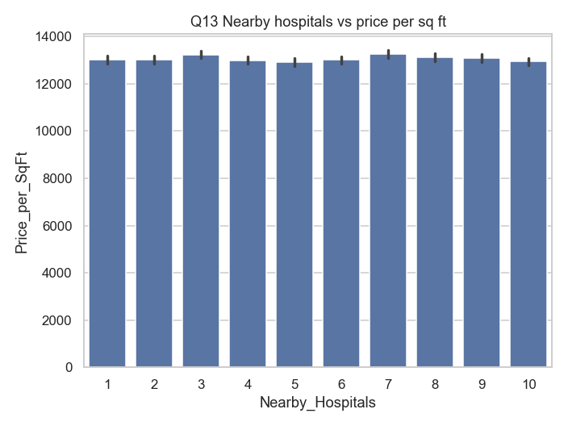

**Q14. How does price vary by furnished status?**
Furnished ₹254.4L, Semi-furnished ₹254.3L, Unfurnished ₹255.0L — no meaningful difference.
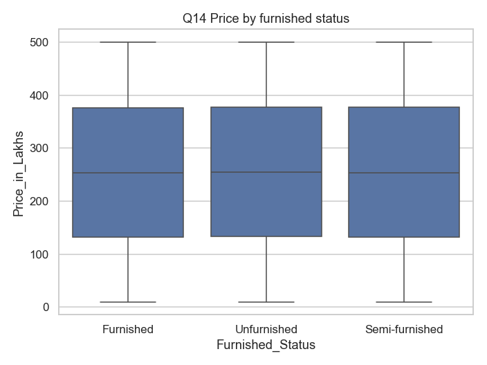

**Q15. How does price per sq ft vary by facing direction?**
East ₹13,024, North ₹13,025, South ₹13,044, West ₹13,140 — flat.
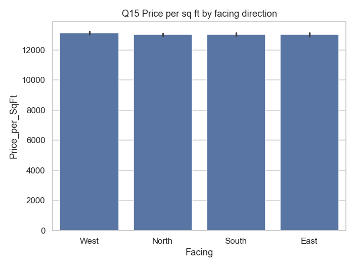

## 16–20: Investment / Amenities / Ownership Analysis

**Q16. How many properties belong to each owner type?**
Broker 83,479 · Owner 83,268 · Builder 83,253 — an even three-way split.
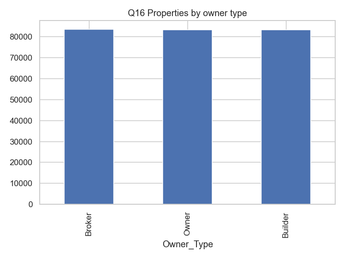

**Q17. How many properties are available under each availability status?**
Under_Construction 125,035 · Ready_to_Move 124,965 — a 50/50 split.
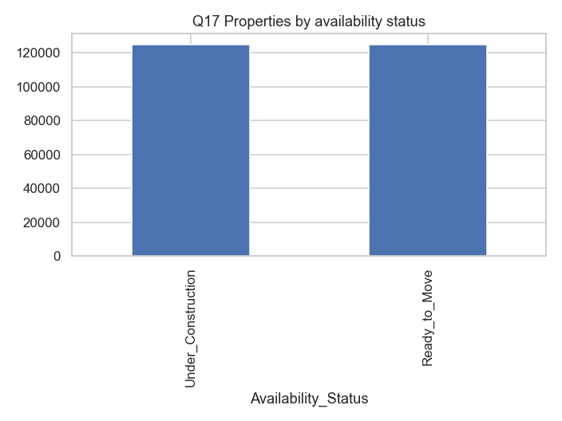

**Q18. Does parking space affect property price?**
No parking ₹254.4L vs parking ₹254.7L — negligible difference.
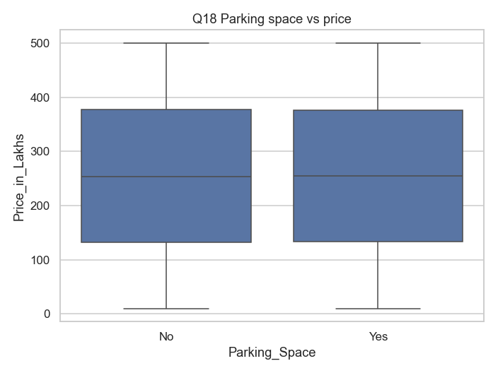

**Q19. How do amenities affect price per sq ft?**
Correlation between amenity count and price/sqft = 0.002 — no effect.
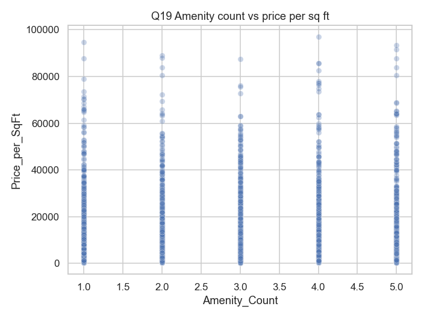

**Q20. How does public transport accessibility relate to price per sq ft or investment potential?**
Price/sqft is flat across transport levels (₹13,027–13,086), but **share of Good Investments rises with transport access**: Low 46.3% → Medium 54.5% → High 62.0%. This is expected — transport access feeds directly into the `Infrastructure_Score` used to build the `Good_Investment` label.
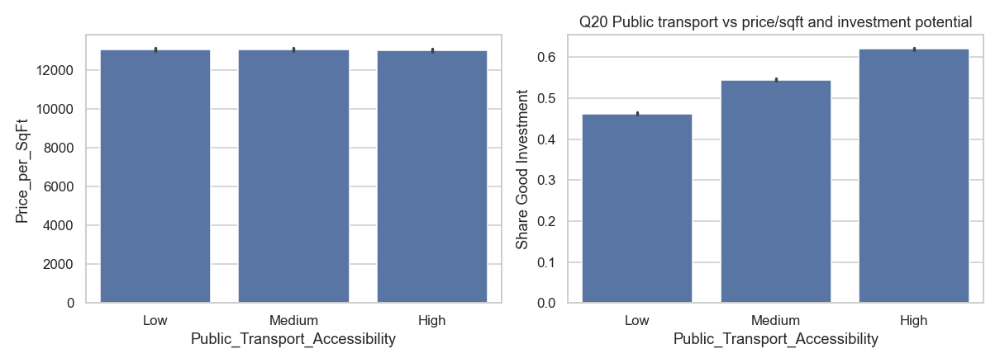

## Extra: Infrastructure score vs investment potential
The brief also asks about crime rate's effect on investment classification — the dataset has no crime-rate column, so infrastructure score (schools + hospitals + transport) is used as the closest available proxy.
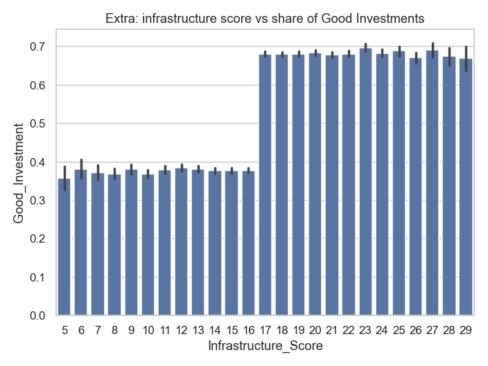

## Takeaway

Outside of `Price_per_SqFt` (which is mathematically tied to price) and public-transport access (which feeds the engineered investment score), **no feature meaningfully predicts price or investment quality** — nearly every correlation in this dataset is within ±0.01 of zero, and category-wise averages (state, city, furnishing, facing, parking, amenities) are all flat. This strongly suggests `india_housing_prices.csv` is synthetically generated rather than sampled from real listings, which is disclosed in [README.md](README.md) and factored into how the two target labels were engineered (see Methodology).
